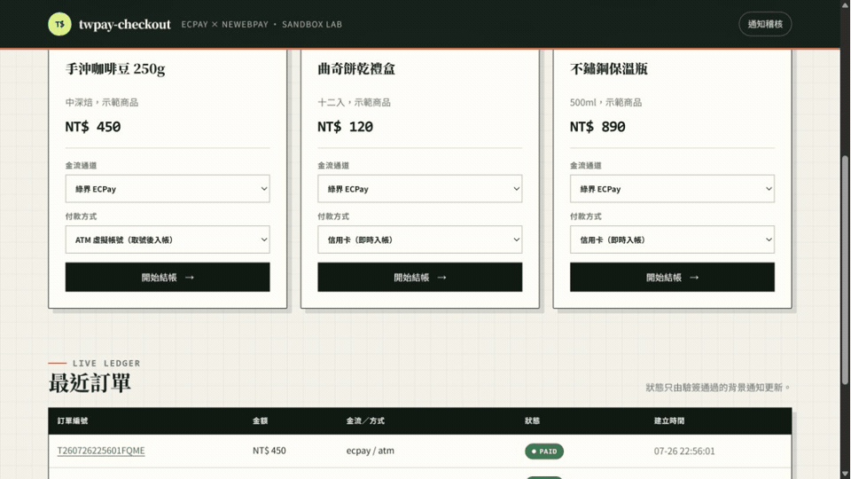
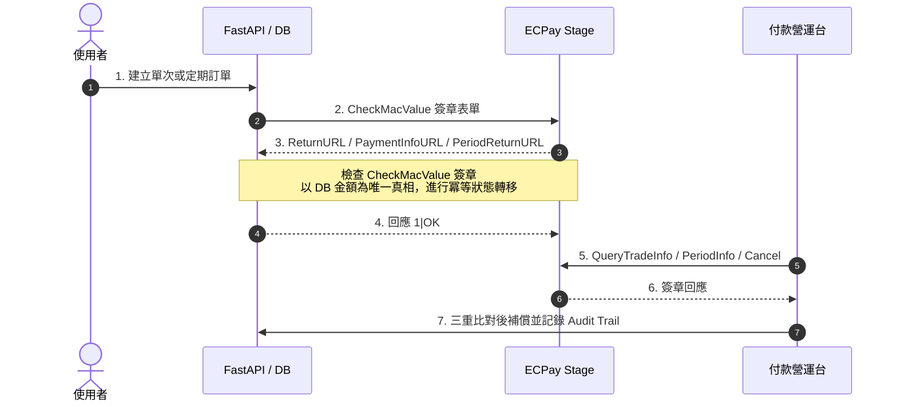
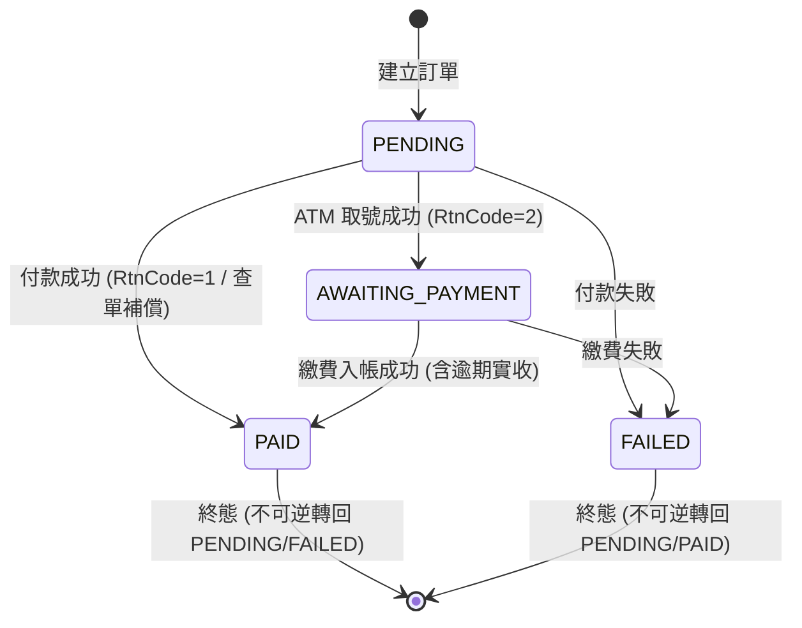

# twpay-payment-lifecycle

[](https://github.com/kuotunyu/twpay-payment-lifecycle/actions/workflows/ci.yml)

[](LICENSE)

本專案為包含完整付款營運生命週期的 FastAPI 系統實作：從綠界科技 (ECPay) 測試環境建單、背景通知驗簽與冪等入帳，延伸至定期定額扣款、主動查單補償、退款政策稽核與每日對帳差異分析。

> **環境限制**：僅使用 ECPay Sandbox 測試環境 (`payment-stage.ecpay.com.tw` 與 `vendor-stage.ecpay.com.tw`)，絕不呼叫或包含 Production 生產端點。



---

## 系統核心機制

1. **信用卡與虛擬帳號 (ATM) 完整生命週期**：
   支援 ECPay AIO V5 hosted checkout、`ReturnURL` 驗簽入帳與 `PaymentInfoURL` ATM 虛擬帳號取號通知。
2. **定期定額與扣款終止控制**：
   實作 `PeriodAmount/Type/Frequency/ExecTimes` 扣款邏輯、`CreditCardPeriodAction` 終止扣款指令與不可逆訂單狀態機。
3. **主動查單補償機制 (Query Recovery)**：
   防範背景通知丟包，透過 `QueryTradeInfo/V5` 進行主動查單；經驗簽、訂單編號與金額三重比對完全相符後方補入帳。
4. **防竄改安全導向與對帳稽核**：
   外部通知必須通過 `CheckMacValue` SHA256 驗簽，金額以資料庫訂單為唯一真相。支援 ECPay CSV V3 每日自動對帳與產出差異報表。

---

## 核心資料流與安全機制



---

## 功能模組與營運台

系統提供完整控制台視窗 (`/admin/operations`)，整合四項日常金流運作：

- **補償 (Recovery)**：向 ECPay Stage 發起主動查單，保存安全比對紀錄。
- **定期定額 (Recurring)**：檢視扣款週期、成功期數、明細履歷與主動終止扣款。
- **退款政策演練 (Refund Policy)**：模擬退款與放棄流程，稽核剩餘可退金額與冪等性 (Idempotency)。
- **每日對帳 (Reconciliation)**：匯入 ECPay CSV V3 報表，產出不可變之平帳與差異明細。

---

## 雙金流 Gateway 對比

專案同時包含合約測試之藍新金流 (NewebPay MPG) Adapter：

| 評測指標 | ECPay AIO V5 | NewebPay MPG |
|---|---|---|
| **請求完整性 (Integrity)** | 參數排序、.NET URL Encode、SHA256 `CheckMacValue` | AES-256-CBC `TradeInfo` + SHA256 `TradeSha` |
| **入帳背景通知** | `ReturnURL`，成功回應 `1|OK` | `NotifyURL`，成功回應 HTTP 200 |
| **ATM 虛擬帳號** | `PaymentInfoURL` 背景通知 | `CustomerURL` 前景導回 |
| **驗證證據層級** | 信用卡 / ATM / 定期定額 / 查詢 / 取消 Live Stage 驗證 | 官方向量與 Callback Contract Tests |

---

## Correctness Guarantees & Failure Safety

系統在 Application 與 Database 兩層落實關鍵防禦矩陣：

| Risk / Failure Scenario | Protection Layer | Enforcement Mechanism |
|---|---|---|
| **Duplicate Webhook / Replay** | Application + DB | 部分唯一索引 (`uq_applied_notification`) + Payload `order_no` 一致性校驗 |
| **Amount Tampering** | Application + DB | 以 DB 訂單金額為唯一真相 + DB `CheckConstraint('amount > 0')` |
| **Partial DB Write / Crash** | DB Transaction Boundary | 單一資料庫交易原子提交業務狀態、稽核列與附隨紀錄，中途異常保證 Rollback |
| **Illegal State Transition** | State Machine Policy | 集中式狀態矩陣 (`transitions.py`)，終態 (`PAID`/`FAILED`/`CANCELED`/`COMPLETED`) 阻斷倒退 |
| **Missed Payment Webhook** | Proactive Recovery | `QueryTradeInfo/V5` 查單驗簽與金額三重比對，原子同步 Order 與 Subscription |
| **Idempotency Key Conflict** | Policy Engine | 相同 Key 傳入衝突參數時拒絕 (`RefundStatus.REJECTED`)，阻斷誤用與覆蓋 |
| **Reconciliation Duplication** | DB Constraint | 對帳明細複合唯一約束 (`uq_reconciliation_item_run_order`) 防範重複比對列 |

---

## 狀態機與交易流程 (Lifecycle & Transaction Flow)

### 訂單生命週期狀態機 (Order State Diagram)



### 背景通知事務與回滾邊界 (Callback Transaction Flow)

```mermaid
flowchart TD
    A[收到 Gateway Webhook] --> B[驗證 CheckMacValue / TradeSha]
    B -- 驗簽失敗 --> C[寫入 REJECTED_SIGNATURE 稽核<br/>回應失敗以利重送]
    B -- 驗簽成功 --> D{比對 Partial Unique Index<br/>gateway, trade_no, kind}
    D -- 已存在 applied 且 Order 一致 --> E[寫入 DUPLICATE 稽核<br/>回應 1|OK 停止重送]
    D -- 首次進站 --> F{比對 DB 金額與狀態轉移矩陣}
    F -- 金額不符 / 非法轉移 --> G[寫入 REJECTED / IGNORED 稽核]
    F -- 驗證通過 --> H[開啟 DB Transaction]
    H --> I[更新 Order / Subscription<br/>寫入 APPLIED 稽核與 Charge]
    I --> J{Commit 成功?}
    J -- 是 --> K[回應 1|OK / HTTP 200]
    J -- 否 (衝突/例外) --> L[Rollback Transaction<br/>兩邊不留半完成狀態]
```

---

## 快速開始

需求：Python 3.11+、`uv`。

```powershell
# 1. 安裝依賴與設定測試環境變數
uv sync --locked
copy .env.example .env

# 2. 執行全量 103 項測試（包含狀態機、故障注入、冪等與 DB 邊界測試）
uv run python -m pytest -q

# 3. 啟動服務 (開啟 http://127.0.0.1:8000/)
uv run python -m uvicorn twpay_checkout.main:app
```

系統測試覆蓋 103 項單元與整合測試，包含 ECPay 官方 CheckMacValue 範例、.NET URL Encode 特殊字元、偽造簽章防禦、ATM 取號/逾期、定期定額扣款、查單補償、狀態機表格驅動測試、交易回滾故障注入測試以及 DB Invariant 防禦測試。
