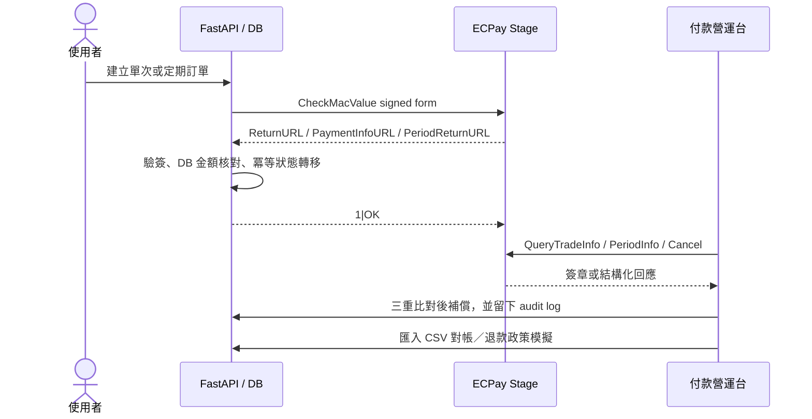

# twpay-checkout — ECPay 付款生命週期實驗室

[](https://github.com/kuotunyu/twpay-payment-lifecycle/actions/workflows/ci.yml)

[](LICENSE)

這不是只有「導到付款頁」的 checkout demo，而是一個用 FastAPI 實作的付款營運系統：
從 ECPay sandbox 建單、背景通知驗簽與冪等入帳，一路做到**定期定額、主動查單補償、
退款政策稽核與每日對帳差異報表**。

> 僅使用測試環境。程式內只允許 `payment-stage.ecpay.com.tw` 與
> `vendor-stage.ecpay.com.tw`；不包含、也不會呼叫 ECPay production endpoint。


上圖是實際 ECPay sandbox ATM 流程：取號通知通過驗簽後進入
`awaiting_payment`，再由測試後台模擬付款，背景通知冪等更新為 `paid`。
實測範圍與日期見 [docs/e2e-results.md](docs/e2e-results.md)。

## 這個作品展示什麼

| 能力 | 展示方式 | 證據層級 |
|---|---|---|
| 信用卡／ATM 收款 | AIO V5 hosted checkout、ReturnURL、PaymentInfoURL | **ECPay live stage E2E** |
| 定期定額 | `PeriodAmount/Type/Frequency/ExecTimes`、明細查詢補回、PeriodReturnURL ledger | **初次授權／查詢 live stage + callback tests** |
| 終止後續扣款 | `CreditCardPeriodAction`、CheckMacValue 驗簽、不可逆狀態機 | **ECPay live stage verified** |
| 漏單補償 | `QueryTradeInfo/V5` 主動查單；驗簽＋編號＋金額全通過才補成 paid | **ECPay live stage verified** |
| 退款／放棄 | 適用方式、訂單狀態、剩餘可退額、全額放棄與 idempotency policy | **明確標示 sandbox simulation** |
| 每日對帳 | CSV V3 parser；matched／缺單／金額／狀態差異，不自動改單 | **可重現 CSV import** |
| 可觀測性 | 原始通知、查單、逐期扣款、定期操作、退款、對帳皆留 audit trail | **SQLite + 營運台** |

為什麼有兩種非 live 模式：

- ECPay 官方明載信用卡請退款 API **沒有測試端點**，所以退款區只展示真實 policy
  與稽核，不把 mock 冒充串接成功，也不在程式內放 production URL。
- 對帳檔 stage 下載需先在 ECPay 後台設定固定 IP 白名單；本專案保留簽章 request
  builder 與下載 CLI，網頁 demo 用相同 parser 匯入 CSV，確保任何人都能重現。

## 付款營運台

`/admin/operations` 把四種日常作業放在同一頁：

1. **Recovery**：向 ECPay stage 主動查單；每次查詢都保存回應與三項安全檢查。
2. **Recurring**：顯示週期、成功期數／金額、逐期交易與終止後續扣款。
3. **Refund policy**：演練退款／放棄，檢查剩餘金額與 idempotency；畫面固定標示 simulation。
4. **Reconciliation**：匯入 ECPay CSV V3，產生不可變的差異明細。

首頁仍可直接建立三種 sandbox 情境：

- 信用卡單次付款
- ATM 虛擬帳號
- 信用卡每月一次、共 3 期

## 核心資料流



安全原則是：**外部資料只能提出證據，不能直接決定本地狀態**。

- 通知先驗 CheckMacValue。
- 金額以 DB 訂單為唯一真相。
- 同一 gateway trade no／通知類型最多 applied 一次，DB 部分唯一索引是最後防線。
- 前景導回只顯示，不入帳。
- Query recovery 必須同時通過回應驗簽、訂單編號與金額比對。
- 對帳報表只指出差異，不偷偷修改訂單。
- 測試金鑰也只放 `.env`，不 commit。

## 快速開始

需求：Python 3.11+、[uv](https://docs.astral.sh/uv/)。

```powershell
uv sync --locked
copy .env.example .env
# 依 .env 內的官方文件連結填入 ECPay 公開 stage 測試資料
uv run python -m pytest -q
uv run python -m uvicorn twpay_checkout.main:app
```

開啟：

- 商品／結帳：<http://127.0.0.1:8000/>
- 付款營運台：<http://127.0.0.1:8000/admin/operations>
- 通知稽核：<http://127.0.0.1:8000/admin/notifications>

接收 ECPay 通知需要公開 HTTPS URL。本機 tunnel、測試卡與 ATM 模擬付款步驟見
[docs/local-testing.md](docs/local-testing.md)。

## 每日對帳 CLI

匯入已下載的 UTF-8 CSV V3：

```powershell
uv run python scripts/reconcile_ecpay.py `
  --file .\ecpay-2026-07-25.csv `
  --begin 2026-07-25 --end 2026-07-25
```

已在 ECPay 測試後台設定 IP 白名單時，可直接使用 stage downloader：

```powershell
uv run python scripts/reconcile_ecpay.py `
  --download-stage --begin 2026-07-25 --end 2026-07-25
```

沒有指定日期時預設處理昨天，適合交給 Windows Task Scheduler 或 cron 每日執行。

## 測試

```powershell
uv run python -m pytest -q   # 56 passed
uv build                     # sdist + wheel
```

測試包含：

- ECPay 官方 CheckMacValue 範例與 .NET URL encode 特殊字元。
- 合法／偽造簽章／金額竄改／重複／失敗／未知訂單通知。
- ATM 取號 → 等待付款 → 入帳，以及逾期 lazy state。
- 定期定額簽章欄位、初次授權、逐期通知、明細查詢補回與重複通知。
- 定期定額 Cancel 回應驗簽與狀態轉移。
- 查單補償的成功、金額不符與 immutable query log。
- 退款 policy 的金額上限與 idempotency。
- 對帳 matched／missing_local／missing_gateway，且匯入不修改訂單。
- 桌面／390px 手機版 UI 瀏覽器 QA。

## 真實 stage 驗證

2026-07-26 已完成：

- 信用卡含 3D OTP：通知驗簽、金額核對、`pending → paid`。
- ATM：取號、`awaiting_payment`、測試後台模擬付款、`paid`。
- `QueryTradeInfo/V5`：兩筆已付款信用卡交易回 `TradeStatus=1`；CheckMacValue、
  MerchantTradeNo 與 NT$450 金額全數相符。未付款 ATM 正確回 `TradeStatus=0`。
- 定期定額：官方付款頁確認每月 NT$450 × 3；測試卡＋3D OTP 後，初次通知通過
  驗簽，訂單 `paid`、計畫 `1/3 active`。
- `QueryCreditCardPeriodInfo`：回 `ExecStatus=1`，本地安全補回首期 charge ledger。
- `CreditCardPeriodAction Cancel`：回應 CheckMacValue 驗簽通過並顯示「停用成功」；
  再查遠端為 `ExecStatus=0`，本地計畫為 `canceled`。

第二期起的 PeriodReturnURL 因週期尚未到，使用簽章正確／錯誤、金額異常與重複通知
整合測試驗證，不宣稱 live second-period callback。

## NewebPay adapter 的定位

repo 仍保留原先完成的 NewebPay MPG adapter：

- AES-256-CBC TradeInfo 加解密
- TradeSha 驗簽
- 信用卡／VACC 通知與冪等整合測試
- 官方文件測試向量

但藍新測試商店需用真實身分註冊且只有 30 天效期，因此它不再是 demo 的執行條件。
README 只把它稱為 **contract-tested adapter**，不宣稱已完成 live E2E。作品主線改成
更能長期重現的 ECPay 完整付款生命週期。

兩個 adapter 的邊界刻意一致，但底層協定不同：

| | ECPay AIO V5 | NewebPay MPG |
|---|---|---|
| Request integrity | 參數排序、.NET URL encode、SHA256 `CheckMacValue` | AES-256-CBC `TradeInfo` + SHA256 `TradeSha` |
| 入帳通知 | `ReturnURL`，成功回 `1|OK` | `NotifyURL`，成功回 HTTP 200 |
| ATM 取號 | `PaymentInfoURL` 背景通知 | `CustomerURL` 前景導回，只允許進入等待付款 |
| 本 repo 證據 | 信用卡／ATM／定期定額／查詢／Cancel live stage | 官方向量與 callback contract tests |
| Demo 依賴 | 官方公開、可長期重現的 stage 特店 | 不需要憑證；live 測試商店僅 30 天 |

## 專案結構

```text
src/twpay_checkout/
├── gateways/          # ECPay／NewebPay adapter、簽章與加解密
├── services/
│   ├── payments.py    # 建單、通知、定期定額狀態機
│   └── operations.py  # 查單、Cancel、退款 policy、對帳
├── routes/            # checkout、callbacks、orders、operations
├── templates/         # Jinja2 + 原生 JS
└── models.py          # order、subscription、audit、refund、reconciliation
scripts/
├── update_tunnel_url.py
└── reconcile_ecpay.py
docs/
├── gateway-notes.md
├── local-testing.md
└── e2e-results.md
```

官方規格、端點、限制與查證日期集中在
[docs/gateway-notes.md](docs/gateway-notes.md)。
